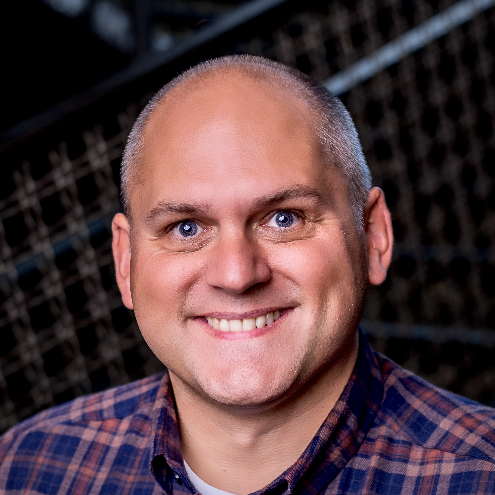
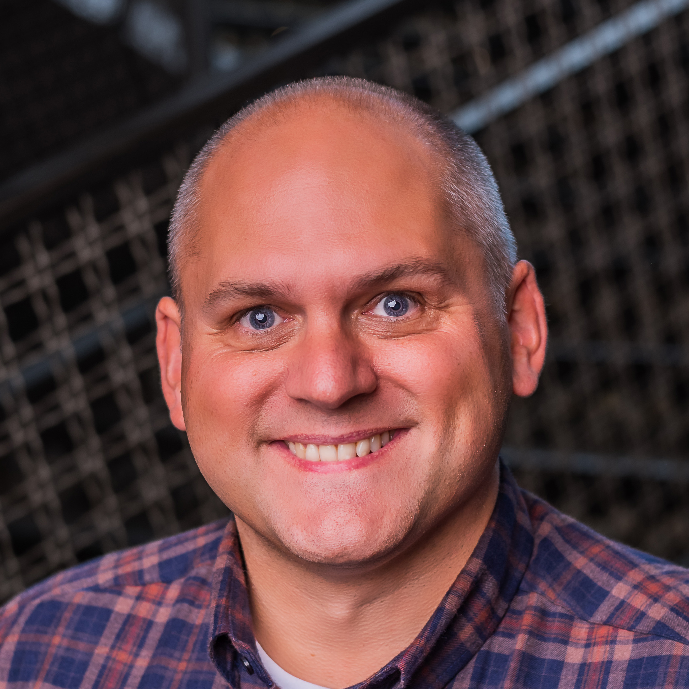
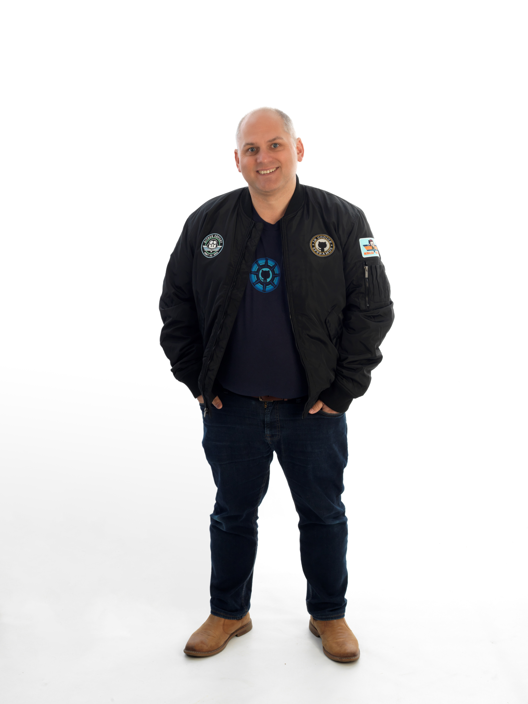
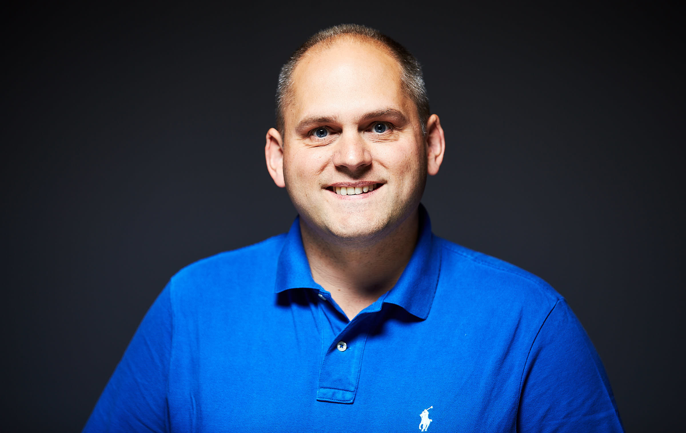
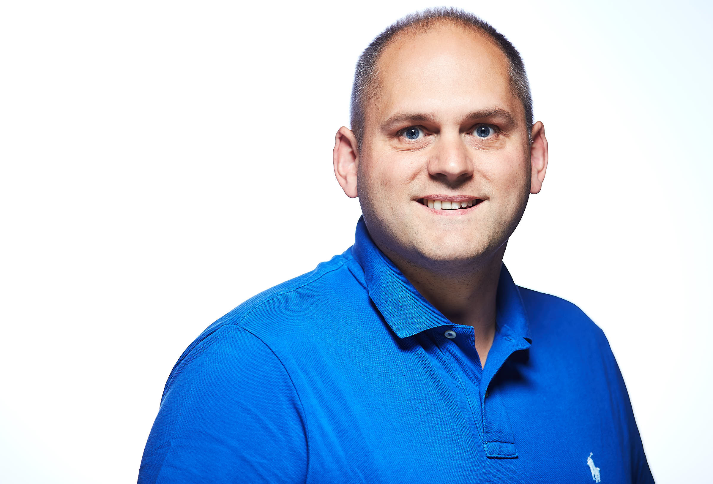
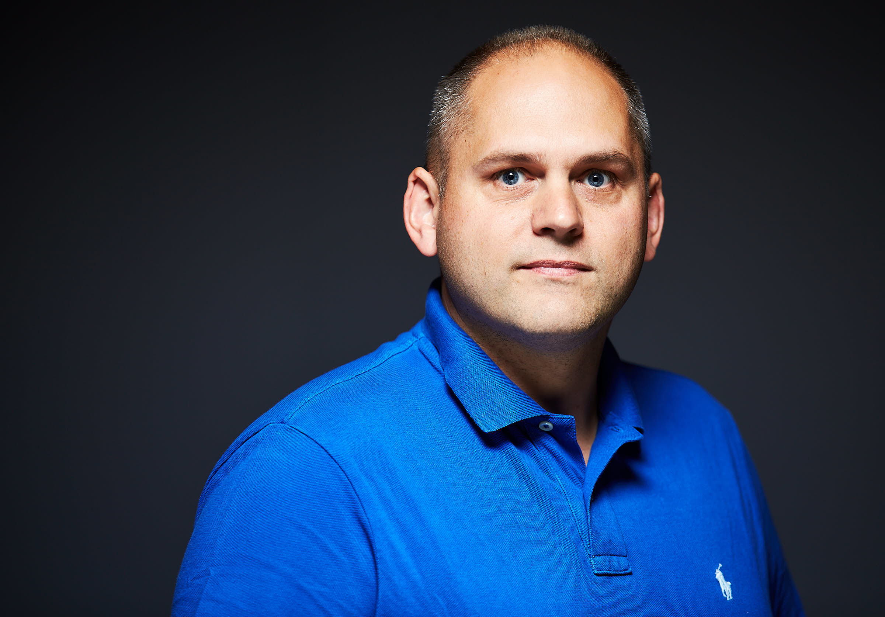
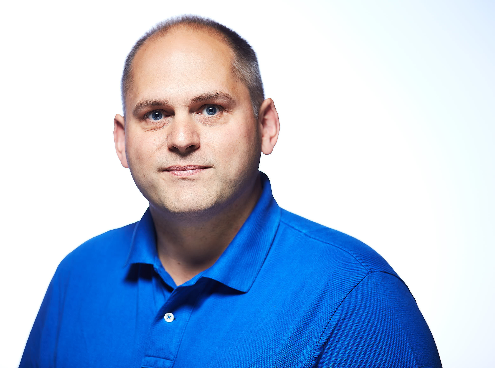

# Headshots

Various headshots below.  [Martin2022-square-social.jpg](Martin2022-square-social.jpg) is preferred and the most recent, but feel free to go with the one that works best for you.

 Note: 167cm / 65.75 inches tall.

